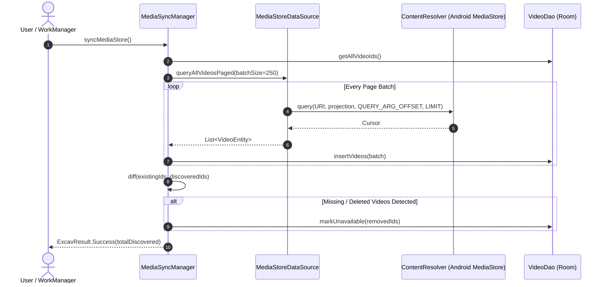
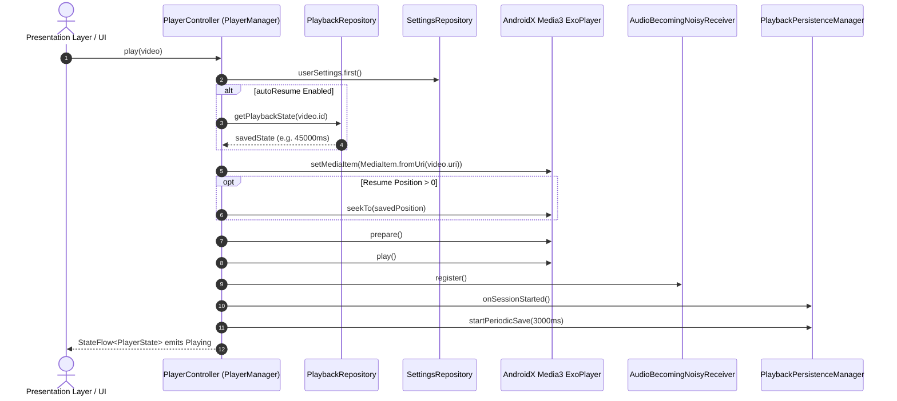
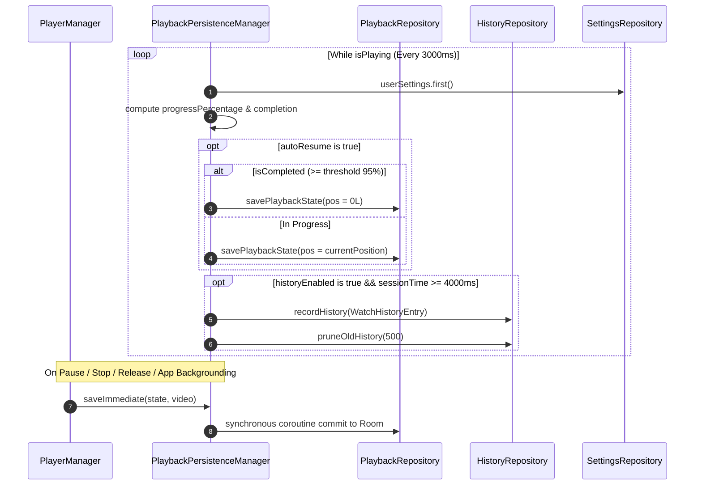
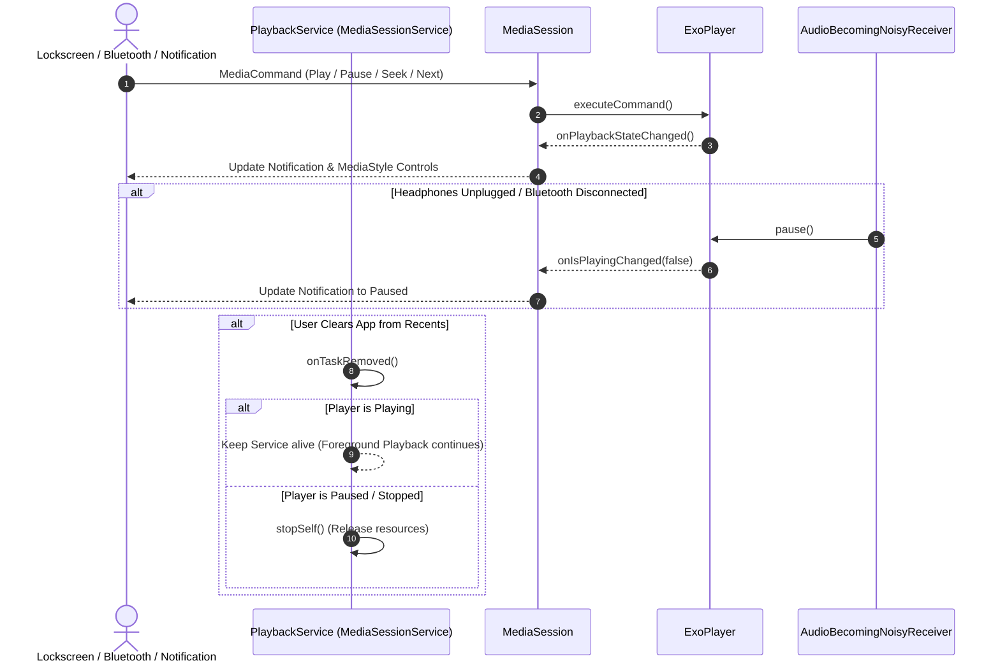
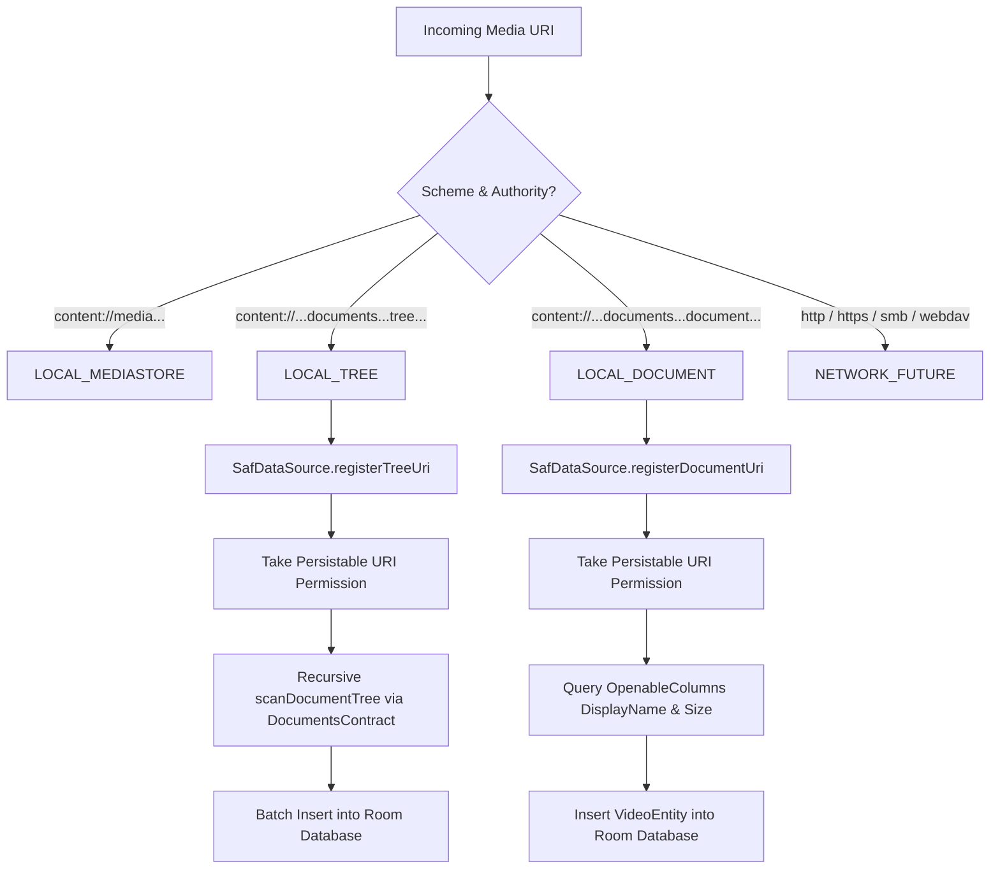

# ExcavPlayer Architecture Guide

This document details the architectural flows, component interactions, and state machines powering the ExcavPlayer backend.

---

## 1. Media Discovery Flow



---

## 2. Playback & State Initialization Flow



---

## 3. Playback Persistence Flow



---

## 4. Background Playback & MediaSession Flow



---

## 5. Storage Access Framework (SAF) Resolution Flow



---

## 6. Playback Queue State Machine

```mermaid
stateDiagram-v2
    [*] --> Idle
    Idle --> InQueue: setQueue(items, startIdx)
    InQueue --> Shuffled: setShuffle(true)
    Shuffled --> InQueue: setShuffle(false)

    state InQueue {
        [*] --> CurrentItem
        CurrentItem --> NextItem: next() (RepeatMode OFF / ALL)
        CurrentItem --> PreviousItem: previous()
        CurrentItem --> CurrentItem: next() (RepeatMode ONE)
    }

    state Shuffled {
        [*] --> ShuffledItem
        ShuffledItem --> NextShuffled: next()
        Note right of Shuffled: Underlying original list order is preserved!
    }
```
